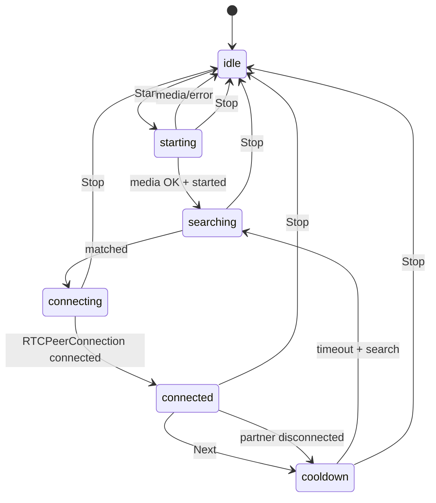
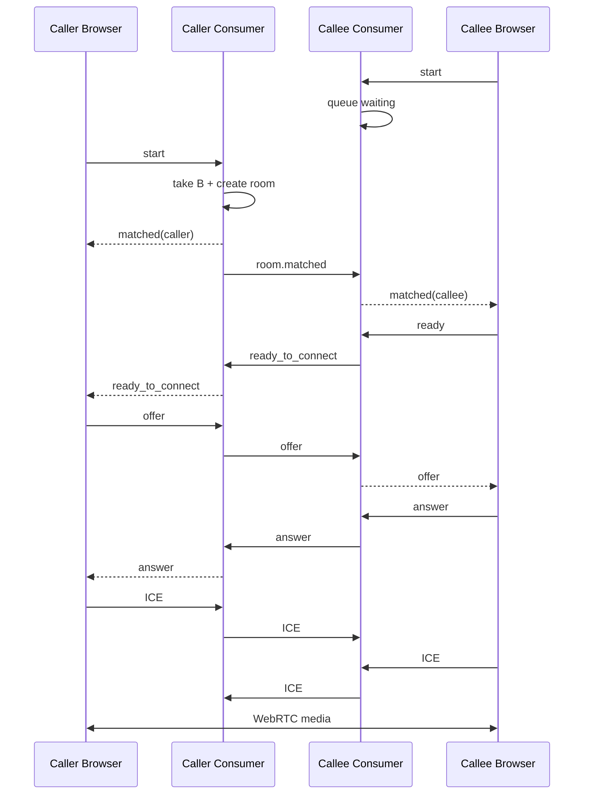

# Video Chat — архитектура, протоколы и руководство по сопровождению

> **Приложение:** `video_chat`  
> **Django app:** `src/video_chat/`  
> **HTTP namespace:** `chat`  
> **Назначение:** developer handoff-документация для разработчика, который должен понять, сопровождать, диагностировать и расширять случайный WebRTC-видеочат без предварительного чтения всего исходного кода.
>
> Документ описывает **текущее состояние реализации**, а не историю разработки или рефакторинга.

---

<a id="contents"></a>
## Содержание

1. [Назначение и границы приложения](#purpose)
2. [Краткая архитектурная модель](#architecture-summary)
3. [Технологический стек](#stack)
4. [Структура приложения и ответственность модулей](#structure)
5. [Точки входа: HTTP, WebSocket и ASGI](#entry-points)
6. [Главные архитектурные принципы](#principles)
7. [Данные и состояние: что хранится, а что нет](#state)
8. [Redis-схема](#redis-schema)
9. [Participant metadata](#participant-metadata)
10. [Matchmaking и очередь ожидания](#matchmaking)
11. [Room lifecycle и хранение комнат](#room-lifecycle)
12. [State machine пользовательского клиента](#state-machine)
13. [Полный пользовательский flow](#user-flow)
14. [WebSocket-протокол пользователя](#user-websocket-protocol)
15. [WebRTC signaling между пользователями](#webrtc-signaling)
16. [Работа камеры, микрофона и peer connection](#media-peer)
17. [Текстовый чат](#text-chat)
18. [Next, cooldown, Stop и disconnect](#next-stop-disconnect)
19. [Модераторская подсистема](#moderation)
20. [Почему модераторский WebRTC отдельный](#moderator-webrtc)
21. [Безопасность moderator flow и stale-room protection](#moderator-security)
22. [Валидация WebSocket-сообщений](#websocket-validation)
23. [STUN, TURN и ICE configuration](#turn)
24. [Frontend: `room.html` + `room.js`](#frontend-user)
25. [Frontend модератора](#frontend-moderator)
26. [Django → JavaScript config и i18n](#django-js-config)
27. [HTTP views и staff-доступ](#http-views)
28. [Тестовая архитектура](#tests)
29. [Локальная настройка и запуск](#local-setup)
30. [Production requirements](#production)
31. [Диагностика и типовые поломки](#troubleshooting)
32. [Как безопасно расширять приложение](#extension)
33. [Как воспроизвести аналогичный модуль с нуля](#reimplementation)
34. [Известные ограничения и будущий hardening](#limitations)
35. [Инварианты, которые нельзя случайно сломать](#invariants)
36. [Краткий справочник](#quick-reference)
37. [Глоссарий](#glossary)

---

<a id="purpose"></a>
## 1. Назначение и границы приложения

`video_chat` реализует случайный анонимный видеочат внутри Django-проекта.

Основная идея:

1. пользователь открывает страницу видеочата;
2. выбирает свой gender **для текущей chat-сессии**;
3. нажимает `Start`;
4. браузер получает доступ к камере и микрофону;
5. WebSocket сообщает backend о старте сессии;
6. backend помещает пользователя в Redis matchmaking queue;
7. следующий участник формирует пару;
8. backend создаёт временную room;
9. браузеры обмениваются WebRTC signaling через Django Channels;
10. после установления WebRTC соединения видео/аудио идут напрямую между браузерами или через TURN relay;
11. пользователь может написать сообщение, нажать `Next` или `Stop`;
12. staff-модератор может видеть активные комнаты, отдельно подключаться к медиапотокам участников и отключать пользователя.

### Что входит в ответственность `video_chat`

- HTTP-страница видеочата;
- WebSocket lifecycle пользовательской chat-сессии;
- Redis matchmaking;
- хранение временных participant metadata;
- хранение временных room metadata;
- WebRTC signaling;
- frontend state machine;
- получение камеры и микрофона;
- текстовый relay-chat внутри текущей пары;
- cooldown между поисками;
- moderator dashboard;
- moderator WebRTC;
- moderator kick;
- STUN/TURN-конфигурация;
- WebSocket input validation;
- regression tests этого функционала.

### Что НЕ входит

- постоянная история переписки;
- сохранение видеозвонков;
- запись аудио/видео;
- `VideoChatSession` в PostgreSQL;
- групповые комнаты;
- обычный `messenger`;
- SFU/MCU серверная обработка медиапотока;
- сложный matching по географии/интересам;
- биллинг/лимиты времени;
- полноценный rate limiting / anti-abuse layer.

> **Ключевой факт:** текущий `video_chat` — Redis/Channels/WebRTC runtime-система. PostgreSQL не является источником истины для активных комнат.

[К содержанию](#contents)

---

<a id="architecture-summary"></a>
## 2. Краткая архитектурная модель

```text
┌──────────────────────────────────────────────────────────────┐
│ Browser                                                      │
│ room.html + room.js                                          │
│ MediaDevices + RTCPeerConnection + WebSocket                 │
└───────────────────────┬──────────────────────────────────────┘
                        │ HTTP / WebSocket
                        ▼
┌──────────────────────────────────────────────────────────────┐
│ Django / Channels                                            │
│ ChatView                                                     │
│ SignalingConsumer                                            │
│ ModeratorConsumer                                            │
└───────────────────────┬──────────────────────────────────────┘
                        │ sync_to_async
                        ▼
┌──────────────────────────────────────────────────────────────┐
│ Services                                                     │
│ MatchmakingService                                           │
│ ParticipantStorage                                           │
│ RoomStorage                                                  │
│ rtc_config                                                   │
│ websocket_message                                            │
└───────────────────────┬──────────────────────────────────────┘
                        │
                        ▼
┌──────────────────────────────────────────────────────────────┐
│ Redis                                                        │
│ chat:queue                                                   │
│ chat:participant:<channel_name>                              │
│ chat:room:<room_id>                                          │
│ chat:room:index                                              │
└──────────────────────────────────────────────────────────────┘
```

Медиапоток не проходит через Django:

```text
User A ───── WebSocket signaling ─────► Django Channels
  ▲                                         │
  │                                         ▼
  └──────────── WebRTC media ─────────── User B
              P2P или TURN relay
```

Backend занимается rendezvous, matchmaking, SDP/ICE relay, session lifecycle, cleanup и moderation. Обычный audio/video transport идёт между WebRTC endpoints напрямую либо через TURN.

[К содержанию](#contents)

---

<a id="stack"></a>
## 3. Технологический стек

### Backend

- Python;
- Django;
- Django Channels;
- ASGI;
- Daphne;
- Redis;
- `channels_redis`;
- `redis-py`;
- `asgiref.sync.sync_to_async`.

### Frontend

- Django Templates;
- JavaScript без frontend framework;
- WebSocket API;
- WebRTC API: `RTCPeerConnection`, `RTCSessionDescription`, `RTCIceCandidate`, `MediaDevices.getUserMedia`;
- Tailwind utility classes;
- HTMX в moderator room list.

### WebRTC infrastructure

- STUN;
- TURN;
- coturn в инфраструктуре проекта;
- ICE negotiation.

### Testing

- pytest;
- pytest-django;
- Channels `WebsocketCommunicator`;
- `InMemoryChannelLayer` в test settings;
- `FakeRedis` для unit/regression tests Redis-логики.

[К содержанию](#contents)

---

<a id="structure"></a>
## 4. Структура приложения и ответственность модулей

```text
src/video_chat/
├── apps.py
├── models.py
├── routing.py
├── urls.py
├── views.py
│
├── consumers/
│   ├── moderator.py
│   └── signaling.py
│
├── services/
│   ├── matchmaking.py
│   ├── participant.py
│   ├── participant_storage.py
│   ├── redis_client.py
│   ├── room_storage.py
│   ├── rtc_config.py
│   └── websocket_message.py
│
├── static/video_chat/js/
│   ├── moderator_room.js
│   └── room.js
│
├── templates/chat/
│   ├── moderator_list.html
│   ├── moderator_room.html
│   ├── room.html
│   └── partials/
│       └── room_list.html
│
└── tests/
    ├── conftest.py
    ├── test_matchmaking.py
    ├── test_moderator_consumer.py
    ├── test_moderator_hardening.py
    ├── test_participant_storage.py
    ├── test_redis_client.py
    ├── test_room_closed_notification.py
    ├── test_room_storage.py
    ├── test_rtc_config.py
    ├── test_signaling_consumer.py
    ├── test_views.py
    └── test_websocket_input_validation.py
```

| Модуль | Ответственность |
|---|---|
| `views.py` | HTTP-страницы, staff access, подготовка metadata для UI |
| `routing.py` | WebSocket URL routing |
| `urls.py` | HTTP URL routing |
| `consumers/signaling.py` | Главный runtime lifecycle пользователя |
| `consumers/moderator.py` | Staff WebSocket управления room |
| `services/matchmaking.py` | Redis queue и атомарное pairing |
| `services/participant.py` | Построение participant metadata |
| `services/participant_storage.py` | Redis participant keys + TTL |
| `services/room_storage.py` | Redis rooms + room index + TTL |
| `services/redis_client.py` | Shared Redis client/connection pool |
| `services/rtc_config.py` | ICE/STUN/TURN config для браузера |
| `services/websocket_message.py` | JSON validation и message size limit |
| `room.js` | User UI state machine + WebRTC + text chat |
| `moderator_room.js` | Staff WebRTC viewers + kick |
| `room.html` | User UI + Django→JS configuration |
| `moderator_list.html` | Staff dashboard + HTMX polling |
| `room_list.html` | Partial списка активных комнат |
| `moderator_room.html` | Staff room UI и JS config |
| `models.py` | DB models сейчас отсутствуют |

[К содержанию](#contents)

---

<a id="entry-points"></a>
## 5. Точки входа: HTTP, WebSocket и ASGI

### HTTP

`src/video_chat/urls.py` сохраняет namespace:

```python
app_name = "chat"
```

Несмотря на имя Django app `video_chat`, URL namespace остаётся `chat`.

| URL | View | Доступ |
|---|---|---|
| `/chat/` | `ChatView` | обычный пользователь / anonymous |
| `/chat/moderate/` | `ModeratorListView` | authenticated staff |
| `/chat/moderate/<room_id>/` | `ModeratorRoomView` | authenticated staff |

### WebSocket

```text
/ws/chat/
    → SignalingConsumer

/ws/chat/moderate/<room_id>/
    → ModeratorConsumer
```

### ASGI

`_config/asgi.py` объединяет WebSocket routing `video_chat` и `messenger` и заворачивает его в `AuthMiddlewareStack`. Поэтому consumers получают `self.scope["user"]` и могут различать anonymous/authenticated/staff.

[К содержанию](#contents)

---

<a id="principles"></a>
## 6. Главные архитектурные принципы

### 6.1 WebSocket connect не означает Start

При открытии `/chat/` frontend сразу создаёт WebSocket, но `SignalingConsumer.connect()` только принимает socket. Пользователь попадает в matchmaking лишь после сообщения `start`.

### 6.2 Камера запрашивается только после Start

```text
page load
→ WebSocket open
→ user chooses gender
→ Start
→ getUserMedia()
→ backend start
```

### 6.3 Active state временный

Participant и room state находятся в Redis, а не PostgreSQL.

### 6.4 Backend контролирует критические ограничения

Frontend управляет UX, но backend повторно проверяет active session, room membership, cooldown, connected state для текста и moderator authorization.

### 6.5 User WebRTC и moderator WebRTC разделены

У participant могут одновременно существовать:

```text
pc           → partner WebRTC
pcModerator  → moderator WebRTC
```

### 6.6 Identity не раскрывается партнёру

Username/profile metadata используются backend/staff UI, но не входят в обычный partner match response.

[К содержанию](#contents)

---

<a id="state"></a>
## 7. Данные и состояние: что хранится, а что нет

`src/video_chat/models.py` не содержит persistent model для chat-session.

PostgreSQL используется только как внешний источник профиля: `user.pk`, username, `Profile.gender`.

### Runtime state в `SignalingConsumer`

```text
room_id
partner_channel
in_room
media_connected
session_id
session_active
search_available_at
```

### Runtime state в browser

```text
ws
pc
pcModerator
localStream
role
chatState
cooldownTimer
startAttempt
startSent
```

### Runtime state в Redis

```text
queue
participant metadata
room metadata
room index
```

При диагностике активную room нужно искать прежде всего в Redis и consumer state, а не в PostgreSQL.

[К содержанию](#contents)

---

<a id="redis-schema"></a>
## 8. Redis-схема

### Matchmaking queue

```text
chat:queue
```

Тип: `LIST`.

### Participant

```text
chat:participant:<channel_name>
```

Тип: `STRING` с JSON. TTL:

```text
21600 секунд = 6 часов
```

### Room

```text
chat:room:<room_id>
```

Тип: `STRING` с JSON. TTL:

```text
7200 секунд = 2 часа
```

### Room index

```text
chat:room:index
```

Тип: `ZSET`:

```text
member = room_id
score  = created_at
```

Moderator dashboard использует его для получения active rooms от новых к старым.

### Почему отдельные keys

TTL применяется к Redis key, а не к отдельному field HASH. Поэтому архитектура «один общий HASH для всех participants/rooms + EXPIRE» не даёт независимого lifecycle сущностей.

Текущий contract:

```text
одна сущность
→ один Redis key
→ индивидуальный TTL
```

### Lazy cleanup index

Если room key истёк, но `room_id` остался в ZSET, `RoomStorage.list_rooms()` обнаруживает отсутствие room и удаляет stale member из index.

[К содержанию](#contents)

---

<a id="participant-metadata"></a>
## 9. Participant metadata

Создаётся `build_participant_metadata()` в `services/participant.py`.

Contract:

```python
{
    "session_id": "...",
    "user_id": 123 or None,
    "username": "peter" or "",
    "is_authenticated": True or False,
    "profile_gender": "male" or "",
    "chat_gender": "couple",
}
```

### `profile_gender` и `chat_gender` — разные значения

`profile_gender` берётся из `Profile` сайта.

`chat_gender` выбирается непосредственно перед `Start`, действует для текущей video-chat session и не меняет профиль.

### Anonymous participant

```python
{
    "user_id": None,
    "username": "",
    "is_authenticated": False,
    "profile_gender": "",
    ...
}
```

### Валидация

`chat_gender` должен присутствовать в `Profile.Gender.values`. Иначе consumer отвечает:

```json
{
  "type": "error",
  "code": "invalid_gender"
}
```

[К содержанию](#contents)

---

<a id="matchmaking"></a>
## 10. Matchmaking и очередь ожидания

`MatchmakingService` использует Redis LIST и Lua script.

### Почему Lua

Три операции должны быть атомарными:

```text
удалить duplicate своего channel
попробовать забрать первого partner
если partner нет — добавить себя
```

Концептуальный алгоритм:

```text
LREM queue all current_channel
partner = LPOP queue

if partner exists:
    return partner

RPUSH queue current_channel
return false
```

### Первый participant

```text
Queue: []
A → join_queue()
partner = none
Queue: [A]
```

### Второй participant

```text
Queue: [A]
B → join_queue()
partner = A
Queue: []
```

Consumer B становится caller и создаёт room с A как callee.

### Stale participant protection

После получения channel backend проверяет `ParticipantStorage.get(partner)`. Если metadata уже нет, найденный entry пропускается и поиск продолжается.

### `leave_queue`

`LREM count=0` удаляет все возможные duplicate entries текущего channel.

[К содержанию](#contents)

---

<a id="room-lifecycle"></a>
## 11. Room lifecycle и хранение комнат

Room создаёт caller. `room_id` — UUID.

```python
{
    "caller": "<channel_name>",
    "callee": "<channel_name>",
    "caller_participant": {...},
    "callee_participant": {...},
    "created_at": 1234567890.0,
}
```

Participant metadata внутри room — snapshot на момент match.

### Создание

```text
caller получает partner
→ читает participant metadata обоих
→ генерирует UUID
→ SET room with TTL
→ ZADD room:index
```

### Уведомление callee

Caller отправляет через channel layer event:

```text
type = room.matched
room_id
caller_channel
```

Он маппится на `room_matched()` callee consumer.

### Удаление

```text
DEL chat:room:<id>
ZREM chat:room:index <id>
```

Затем moderator group получает:

```text
moderate_<room_id>
room.closed
```

[К содержанию](#contents)

---

<a id="state-machine"></a>
## 12. State machine пользовательского клиента

`room.js` использует явный `chatState`:

```text
idle
starting
searching
connecting
connected
cooldown
```



### UI policy

`idle`:

- gender enabled;
- Start visible;
- Stop hidden;
- Next hidden;
- chat disabled.

Active states:

- gender frozen;
- Start hidden;
- Stop visible.

`connected` дополнительно:

- Next visible;
- chat enabled.

[К содержанию](#contents)

---

<a id="user-flow"></a>
## 13. Полный пользовательский flow

### 13.1 Page load

`ChatView` рендерит `chat/room.html` с `rtc_config` и `Profile.Gender.choices`.

### 13.2 WebSocket

JS создаёт:

```text
ws(s)://<host>/ws/chat/
```

После `onopen` остаётся `idle`. Matchmaking не запускается.

### 13.3 Start

Frontend:

1. проверяет gender;
2. проверяет WebSocket;
3. `state = starting`;
4. вызывает `getUserMedia({video:true,audio:true})`;
5. после успеха отправляет:

```json
{
  "type": "start",
  "gender": "..."
}
```

### 13.4 Backend Start

`_handle_start()`:

1. запрещает повторный Start active session;
2. генерирует `session_id`;
3. валидирует gender;
4. строит participant metadata;
5. `session_active = True`;
6. сохраняет participant в Redis;
7. отвечает `started`;
8. запускает `_find_partner()`.

### 13.5 Waiting

Если partner нет:

```json
{
  "type": "status",
  "message": "waiting"
}
```

Frontend переходит в `searching`.

### 13.6 Match

Caller получает:

```json
{
  "type": "matched",
  "room_id": "...",
  "role": "caller"
}
```

Callee получает аналогичный response с `role=callee` через `room.matched`.

Оба создают peer connection и переходят в `connecting`.

### 13.7 Ready handshake

Callee после setup отправляет:

```json
{"type":"ready"}
```

Caller получает `ready_to_connect` и только после этого создаёт offer.

### 13.8 Connected

Когда:

```javascript
pc.connectionState === "connected"
```

frontend переходит в `connected` и отправляет:

```json
{"type":"connected"}
```

Backend устанавливает `media_connected=True`, что разрешает text chat.

[К содержанию](#contents)

---

<a id="user-websocket-protocol"></a>
## 14. WebSocket-протокол пользователя

Endpoint:

```text
/ws/chat/
```

### Client → server

```json
{"type":"start","gender":"male"}
{"type":"search"}
{"type":"next"}
{"type":"stop"}
{"type":"connected"}
{"type":"ready"}
{"type":"offer","sdp":{}}
{"type":"answer","sdp":{}}
{"type":"ice_candidate","candidate":{}}
{"type":"chat_message","text":"Hello"}
```

### Server → client lifecycle

```json
{"type":"started","session_id":"...","chat_gender":"..."}
{"type":"status","message":"waiting"}
{"type":"matched","room_id":"...","role":"caller"}
{"type":"cooldown","seconds":3}
{"type":"partner_disconnected","seconds":3}
{"type":"stopped"}
{"type":"kicked"}
{"type":"error","code":"..."}
```

### Signaling envelope

Channel-layer signaling браузер получает как:

```json
{
  "payload": {
    "type": "offer"
  }
}
```

### Error codes

```text
already_started
invalid_gender
no_active_session
invalid_payload
message_too_large
unsupported_type
```

[К содержанию](#contents)

---

<a id="webrtc-signaling"></a>
## 15. WebRTC signaling между пользователями

Django Channels доставляет только signaling, не media.



Caller создаёт offer, callee создаёт answer. ICE candidate каждого peer пересылаются partner через WebSocket → Channels.

[К содержанию](#contents)

---

<a id="media-peer"></a>
## 16. Работа камеры, микрофона и peer connection

### Local media

```javascript
navigator.mediaDevices.getUserMedia({
    video: true,
    audio: true,
})
```

Stream сохраняется в `localStream`, отображается в `localVideo` и его tracks добавляются в `RTCPeerConnection` через `addTrack()`.

### Remote media

`pc.ontrack` устанавливает первый remote stream в `remoteVideo.srcObject`.

### Connection success

Главный frontend criterion:

```javascript
pc.connectionState === "connected"
```

### Тонкость `setupPeerConnection()`

Внутри setup закрываются `closeMainPeer()` и `closeModeratorPeer()`, но не вызывается полный `closePeerConnections()`, потому что полный helper также сбрасывает `role`. Потеря `role` способна сломать caller flow после `ready_to_connect`.

### Media cleanup

`stopLocalMedia()` останавливает tracks, очищает stream/video и вызывается при reset, WebSocket close и `beforeunload`.

[К содержанию](#contents)

---

<a id="text-chat"></a>
## 17. Текстовый чат

Текст идёт через Channels, а не WebRTC DataChannel.

Frontend разрешает send только при:

```text
chatState == connected
```

Backend дополнительно требует:

```text
session_active
media_connected
partner_channel
room_id
```

`media_connected` становится True только после browser message `connected`, который отправляется после реального `RTCPeerConnection.connectionState === "connected"`.

Backend обрезает текст до 500 символов; HTML input также имеет `maxlength=500`.

История не сохраняется и очищается при Next, disconnect, Stop и новом match.

[К содержанию](#contents)

---

<a id="next-stop-disconnect"></a>
## 18. Next, cooldown, Stop и disconnect

### Next

Frontend разрешает Next только в `connected`, закрывает peers, очищает chat и отправляет `next`.

Backend:

```text
leave queue
→ end current room
→ notify partner
→ delete room
→ notify moderator group
→ start cooldown
```

### Cooldown

```text
COOLDOWN_SECONDS = 3
```

Backend использует `time.monotonic()` и повторно проверяет remaining time при `search`. Поэтому cooldown server-enforced, а JS timer — только UX.

### Partner disconnect

Если session активна, второй participant автоматически входит в cooldown и затем снова search.

### Stop

Frontend мгновенно делает полный UI reset. Если `Start` уже был отправлен server, дополнительно отправляется `stop`.

Backend удаляет queue entry, room, participant metadata и очищает session state.

### WebSocket disconnect

`disconnect()` всегда запускает cleanup и уведомляет partner. Это последняя защита от stale state.

[К содержанию](#contents)

---

<a id="moderation"></a>
## 19. Модераторская подсистема

Модерация состоит из:

```text
ModeratorListView
ModeratorRoomView
ModeratorConsumer
moderator_list.html
room_list.html
moderator_room.html
moderator_room.js
```

### Доступ

HTTP требует authenticated `is_staff` через `StaffRequiredMixin`.

WebSocket также самостоятельно проверяет `self.scope["user"]`.

Close codes:

```text
4403 = anonymous/non-staff
4404 = room не существует
```

### Moderator dashboard

URL:

```text
/chat/moderate/
```

Для active room показывает caller/callee metadata:

- authenticated/anonymous;
- username;
- profile URL;
- profile gender;
- chat gender;
- возраст room.

### Polling

`moderator_list.html` использует HTMX:

```text
hx-trigger="load, every 5s"
```

HTMX request получает только partial `chat/partials/room_list.html`.

### Moderator room

```text
/chat/moderate/<room_id>/
```

Если room уже исчезла, HTTP view redirect'ит обратно в moderator list.

[К содержанию](#contents)

---

<a id="moderator-webrtc"></a>
## 20. Почему модераторский WebRTC отдельный

Moderator browser создаёт два отдельных peer connection:

```text
pcCaller
pcCallee
```

Каждый имеет `recvonly` transceivers для video/audio.

Архитектура:

```text
User A ───── main WebRTC ───── User B

User A ───── moderator WebRTC ───── Moderator
User B ───── moderator WebRTC ───── Moderator
```

Модератор не подключается «третьим участником» к уже существующему user-user peer connection.

### Signaling

Moderator создаёт offer и отправляет participant target channel. Backend добавляет `from_moderator=True`.

Participant создаёт отдельный `pcModerator`, отвечает с `from_moderator_reply=True`.

Backend сам добавляет:

```text
answering_channel = self.channel_name
```

То есть browser не имеет authority над своей Channels identity.

### Ограничение

Participant browser технически знает о дополнительном peer connection. Truly invisible server-side observation потребует media-server/SFU architecture.

[К содержанию](#contents)

---

<a id="moderator-security"></a>
## 21. Безопасность moderator flow и stale-room protection

Критический сценарий:

```text
Room A: User X + User Y
Moderator открыл Room A
User X нажал Next
Room A удалена
User X тем же WebSocket channel попал в Room B
```

Если moderator consumer доверяет только metadata, сохранённой при initial connect, старая вкладка Room A может попытаться воздействовать на channel User X уже в Room B.

### Защита 1: re-validation

Перед каждым privileged action:

```text
kick
moderator signaling
```

`ModeratorConsumer` заново читает `RoomStorage.get_room(room_id)` и проверяет target против актуальных caller/callee.

### Защита 2: `room.closed`

При удалении room user consumer отправляет group event:

```text
moderate_<room_id>
room.closed
```

ModeratorConsumer отправляет browser `room_closed` и закрывает socket.

### Почему нужны оба слоя

`room.closed` обеспечивает правильный lifecycle/UI.

Re-validation является security guarantee при race condition, задержанном event или stale action из старой вкладки.

[К содержанию](#contents)

---

<a id="websocket-validation"></a>
## 22. Валидация WebSocket-сообщений

Общий decoder находится в:

```text
services/websocket_message.py
```

и используется обоими consumers.

### Лимит

```text
MAX_WEBSOCKET_MESSAGE_BYTES = 65536
```

То есть 64 KiB UTF-8 bytes.

### Допустимый формат

Только:

```text
text WebSocket frame
+ valid JSON
+ top-level JSON object
```

### Invalid JSON / non-object

```json
{
  "type": "error",
  "code": "invalid_payload"
}
```

Socket остаётся живым.

### Oversized

```json
{
  "type": "error",
  "code": "message_too_large"
}
```

после чего socket закрывается кодом `4409`.

### Unknown type

```json
{
  "type": "error",
  "code": "unsupported_type"
}
```

### Что пока не покрыто

- schema validation SDP;
- schema validation ICE candidate;
- per-message-type limits;
- rate limiting;
- flood protection.

[К содержанию](#contents)

---

<a id="turn"></a>
## 23. STUN, TURN и ICE configuration

`services/rtc_config.py` формирует browser `iceServers`.

Всегда добавляется:

```text
stun:stun.l.google.com:19302
```

При полном TURN triplet:

```text
TURN_URL
TURN_USER
TURN_PASSWORD
```

добавляется TURN server.

Пример:

```json
{
  "iceServers": [
    {"urls": "stun:stun.l.google.com:19302"},
    {
      "urls": "turn:turn.example.com:3478",
      "username": "...",
      "credential": "..."
    }
  ]
}
```

### Production enforcement

`_config/settings/prod.py` содержит:

```python
VIDEO_CHAT_REQUIRE_TURN = True
```

и production settings требуют `TURN_URL`, `TURN_USER`, `TURN_PASSWORD`.

`get_rtc_config()` дополнительно выбрасывает `ImproperlyConfigured`, если TURN required, но credentials неполные.

### Тонкость текущих settings

В `base.py` `TURN_*` также читаются через environment helper. Поэтому фактическая возможность запустить конкретное dev/test окружение без этих env зависит от settings/env проекта, несмотря на то, что сама функция `get_rtc_config()` умеет формировать STUN-only config при falsey TURN settings.

### Зачем TURN нужен production

STUN не гарантирует P2P через symmetric NAT, строгие firewall и некоторые mobile/corporate networks. TURN даёт relay path:

```text
User A → TURN → User B
```

### Security note

Текущие TURN credentials статические и попадают в browser. Для серьёзного public traffic рекомендуется перейти на short-lived TURN credentials с expiry.

[К содержанию](#contents)

---

<a id="frontend-user"></a>
## 24. Frontend: `room.html` + `room.js`

### Разделение ответственности

`room.html`:

- markup;
- Django i18n;
- `rtc_config`;
- gender choices;
- `window.videoChatConfig`.

`room.js`:

- state machine;
- WebSocket lifecycle;
- media permissions;
- partner WebRTC;
- moderator WebRTC response;
- text chat;
- cooldown;
- Start/Next/Stop.

### `startAttempt`

Это async-race guard вокруг `getUserMedia()`.

Сценарий, от которого он защищает:

```text
Start
→ getUserMedia pending
→ session/reset изменился
→ старый promise завершился
```

Старый attempt не должен внезапно стартовать уже отменённую session.

### `startSent`

Показывает, был ли backend `start` реально отправлен. Stop использует его, чтобы не слать server cleanup для session, которая фактически не стартовала.

### `wsSend`

Все outgoing messages проходят через helper, который проверяет `WebSocket.OPEN`.

[К содержанию](#contents)

---

<a id="frontend-moderator"></a>
## 25. Frontend модератора

`moderator_room.js` получает:

```javascript
window.videoChatModeratorConfig = {
    roomId,
    caller,
    callee,
    rtcConfig,
}
```

После `room_info`:

```text
setupPeerWith(caller)
setupPeerWith(callee)
```

Для каждого participant создаётся новый `RTCPeerConnection` с `video/audio recvonly`, moderator создаёт offer и отправляет target channel.

### Response mapping

Participant response получает от backend `answering_channel`. Moderator browser сравнивает его с `CALLER/CALLEE` и выбирает правильный `pcCaller/pcCallee`.

### Kick

Template использует:

```html
data-kick-role="caller"
data-kick-role="callee"
```

JS после confirm отправляет:

```json
{
  "type": "kick",
  "target": "<channel>"
}
```

### Cleanup

При WebSocket close оба peer закрываются, video `srcObject` очищаются, UI сообщает, что room завершена.

[К содержанию](#contents)

---

<a id="django-js-config"></a>
## 26. Django → JavaScript config и i18n

`room.html` создаёт translated strings через Django i18n и передаёт их внешнему JS:

```javascript
window.videoChatConfig = {
    rtcConfig: ...,
    i18n: {...},
}
```

Строки проходят `escapejs`, RTC config передаётся как server-generated JSON.

### Правило расширения

Если добавляется новый frontend status/error:

1. добавить translated message в template;
2. добавить field в `window.videoChatConfig.i18n`;
3. использовать его в `room.js`.

Не следует помещать Django template tags внутрь static `room.js`: static asset не проходит Django template rendering.

[К содержанию](#contents)

---

<a id="http-views"></a>
## 27. HTTP views и staff-доступ

### `ChatView`

Передаёт:

```python
{
    "rtc_config": get_rtc_config(),
    "gender_choices": Profile.Gender.choices,
}
```

### `StaffRequiredMixin`

Использует `LoginRequiredMixin + UserPassesTestMixin` и проверяет `request.user.is_staff`.

### `ModeratorListView`

1. получает `RoomStorage.list_rooms()`;
2. decorates participant metadata;
3. вычисляет room age;
4. full request возвращает moderator page;
5. HTMX request возвращает только partial list.

### Presentation decoration

Redis хранит raw metadata. `views.py` добавляет для template:

```text
profile_gender_label
chat_gender_label
profile_url
```

Это не записывается обратно в Redis.

### `ModeratorRoomView`

Получает room по `room_id`. Если room исчезла — redirect в список. Если есть — передаёт room data и RTC config в template.

[К содержанию](#contents)

---

<a id="tests"></a>
## 28. Тестовая архитектура

Последний полный regression run проекта после refactor:

```text
483 passed
1 xfailed
```

Последний отдельный run `video_chat`:

```text
52 passed
```

### Test channel layer

Test settings используют:

```python
channels.layers.InMemoryChannelLayer
```

Поэтому WebSocket tests не требуют внешнего Redis channel layer.

### `FakeRedis`

`tests/conftest.py` реализует нужный subset Redis API:

```text
SET / GET
ZADD / ZREM / ZREVRANGE
LREM / LPOP / RPUSH
DELETE
EXPIRE
EVAL
```

Fixture monkeypatch'ит shared `redis.from_url()`.

`get_redis_client.cache_clear()` вызывается до/после fixture, потому что production helper cached через `lru_cache(maxsize=1)`.

### Что тестируется

`test_signaling_consumer.py`:

- connect без auto-matchmaking;
- Start;
- anonymous/authenticated metadata;
- profile/chat gender separation;
- invalid gender;
- match;
- signaling;
- text chat guard;
- cooldown;
- Stop cleanup;
- moderator signaling isolation.

`test_moderator_consumer.py`:

- staff authorization;
- missing room;
- room info;
- signaling;
- foreign target rejection;
- kick.

`test_moderator_hardening.py`:

- stale-room re-validation;
- stale signaling rejection;
- room.closed.

`test_matchmaking.py`:

- first waiter;
- second user pairing;
- duplicate removal;
- single atomic Redis eval;
- leave queue.

`test_room_storage.py`:

- create/get/delete;
- metadata;
- TTL;
- index ordering;
- stale index cleanup.

`test_participant_storage.py`: participant round-trip/TTL.

`test_redis_client.py`: reuse cached client.

`test_websocket_input_validation.py`: malformed JSON, non-object, unknown type, oversized input.

`test_rtc_config.py`: STUN/TURN contracts и production requirement.

`test_views.py`: HTTP context, staff access, HTMX partial и moderator room.

### App tests

```bash
docker compose --env-file .env.dev -f docker/compose.dev.yml exec web \
    pytest video_chat/tests \
    --ds=_config.settings.test
```

### Подробно

```bash
docker compose --env-file .env.dev -f docker/compose.dev.yml exec web \
    pytest video_chat/tests \
    --ds=_config.settings.test -vv
```

### Весь проект

```bash
docker compose --env-file .env.dev -f docker/compose.dev.yml exec web \
    pytest \
    --ds=_config.settings.test
```

[К содержанию](#contents)

---

<a id="local-setup"></a>
## 29. Локальная настройка и запуск

### Необходимые компоненты

```text
Django
Channels
Daphne
channels_redis
redis-py
Redis
STUN/TURN для полноценного WebRTC
```

### Ключевые env для `video_chat`

```env
REDIS_URL=redis://redis:6379/0
TURN_URL=turn:...
TURN_USER=...
TURN_PASSWORD=...
```

Полный набор env определяется общими Django settings/Docker Compose.

### Проверить Redis в dev

```bash
docker compose --env-file .env.dev -f docker/compose.dev.yml exec redis \
    redis-cli KEYS 'chat:*'
```

Один waiting participant:

```text
chat:queue
chat:participant:<channel>
```

После match:

```text
chat:participant:<caller>
chat:participant:<callee>
chat:room:<uuid>
chat:room:index
```

Participant TTL должен быть около `21600`, room TTL — около `7200`.

В production для большого keyspace использовать `SCAN`, не `KEYS`.

[К содержанию](#contents)

---

<a id="production"></a>
## 30. Production requirements

### ASGI

WebSocket требует ASGI server. Обычного WSGI недостаточно.

### Redis

И Channels layer, и runtime storage должны видеть Redis.

`CHANNEL_LAYERS` требует `REDIS_URL`. `redis_client.py` имеет localhost fallback, но production не должен на него рассчитывать.

### TURN

Production устанавливает `VIDEO_CHAT_REQUIRE_TURN=True`; рабочие TURN credentials обязательны.

### HTTPS/WSS

Frontend выбирает `ws` для HTTP и `wss` для HTTPS. Production должен использовать HTTPS.

### Reverse proxy

Proxy обязан поддерживать WebSocket upgrade для:

```text
/ws/chat/
/ws/chat/moderate/*
```

### Coturn network

Должны быть доступны listener ports и relay port range по текущей coturn configuration, UDP/TCP согласно инфраструктуре.

[К содержанию](#contents)

---

<a id="troubleshooting"></a>
## 31. Диагностика и типовые поломки

### Start ничего не делает

Проверять по цепочке:

```text
/ws/chat/ открыт?
gender выбран?
getUserMedia разрешён?
start отправлен?
participant Redis key появился?
chat:queue появился?
```

### Один пользователь вечно Searching

Проверить:

```text
chat:queue
chat:participant:*
```

Channel в queue без participant metadata — stale state.

### Matched есть, видео нет

Разбить handshake:

```text
matched
→ ready
→ offer
→ answer
→ ICE
→ connectionState
```

Если signaling дошёл, но connection не устанавливается — проверить TURN/NAT/firewall.

### Работает в одной сети, не работает через mobile/corporate network

Первый кандидат — TURN/ICE connectivity.

### Chat disabled после появления видео

Проверить реальный `pc.connectionState`, отправку `{type:"connected"}` и backend `media_connected`.

### Next без паузы

Backend `_handle_search()` должен вернуть remaining cooldown; frontend timer не является единственной защитой.

### Stop → Start ломается

Проверить frontend reset:

```text
startAttempt
startSent
role
localStream
pc
pcModerator
chatState
```

и backend cleanup:

```text
queue
room
participant metadata
session_active
```

### Moderator list показывает уже исчезнувшую room

Проверить `chat:room:index`. `list_rooms()` должен удалить stale index member, если room key уже отсутствует.

### Старая moderator tab воздействует после Next

Это security regression. Проверить `_get_room()`, `_is_room_participant()` и `room.closed`. Нельзя использовать cached room metadata как единственный authorization source.

### Redis TTL = -2

Key не существует.

### Redis TTL = -1

Key существует без expiration. Для participant/room это нарушение текущего contract.

[К содержанию](#contents)

---

<a id="extension"></a>
## 32. Как безопасно расширять приложение

### Matching filters

Сейчас queue одна: `chat:queue`.

Для gender/geo/preferences возможны:

1. несколько queues;
2. searchable waiting metadata + atomic claim.

В обоих вариантах главное условие: два concurrent consumers не должны забрать одного partner.

### Premium priority

Нужно проектировать fairness/starvation policy, а не просто бесконечно `LPUSH` premium users.

### Blacklist

Проверку совместимости/блокировки нужно выполнять до создания room; anonymous требует отдельной policy.

### Persistence / analytics

Если нужны duration, billing, reports, moderation history — можно добавить durable session summary/event models. Не следует писать high-frequency SDP/ICE в PostgreSQL.

### Reports

Room ephemeral, поэтому report должен хранить durable snapshot target/session metadata, а не зависеть от живого `room_id`.

### Time limits

Server должен быть authority; browser timer — UI.

### WebRTC DataChannel

Можно перенести text chat из Channels в DataChannel, но тогда меняются moderation visibility, server enforcement и reconnect semantics.

### SFU

SFU меняет архитектуру на:

```text
Browser → SFU → Browser
```

Это даёт server-side media topology, multi-party и более мощную moderation, но существенно усложняет infrastructure.

[К содержанию](#contents)

---

<a id="reimplementation"></a>
## 33. Как воспроизвести аналогичный модуль с нуля

Если нужно повторить архитектуру в другом Django-проекте:

1. настроить ASGI + Channels + `AuthMiddlewareStack`;
2. настроить Redis Channel Layer;
3. создать user WebSocket consumer;
4. отделить WebSocket connect от explicit Start;
5. сформировать ephemeral participant metadata;
6. реализовать atomic Redis queue claim;
7. создавать UUID room с caller/callee snapshot и TTL;
8. определить явную frontend state machine;
9. после user gesture получить media через `getUserMedia`;
10. создать `RTCPeerConnection` и добавить tracks;
11. сделать ready handshake до caller offer;
12. relay offer/answer/ICE через Channels;
13. cleanup queue/room/participant на Next/Stop/disconnect;
14. настроить TURN;
15. для moderator WebRTC использовать отдельные peers и separate signaling markers;
16. revalidate moderator targets по актуальной room;
17. покрыть queue/TTL/lifecycle/security regression tests.

Минимальный набор WebSocket commands:

```text
start
search
next
stop
connected
ready
offer
answer
ice_candidate
chat_message
```

[К содержанию](#contents)

---

<a id="limitations"></a>
## 34. Известные ограничения и будущий hardening

Эти пункты не являются незавершённым текущим refactor.

### Rate limiting / anti-abuse

Нет полноценного frequency control для Start/Next/Search/chat/signaling. Это важно перед большим anonymous traffic.

### `redis.asyncio`

Сейчас async consumer вызывает sync Redis services через `sync_to_async`. Это корректно. При высокой concurrency можно отдельно перейти на async Redis API.

### Real Redis integration tests в CI

FakeRedis хорошо покрывает business logic, но полезен дополнительный небольшой suite с настоящим Redis для Lua/TTL/ZSET/atomic semantics.

### Short-lived TURN credentials

Текущие static credentials видимы browser. Для public traffic лучше временные TURN credentials с expiry.

### Lifecycle logging

Можно добавить structured events `start/waiting/matched/connected/next/stop/disconnect/room_closed/moderator_kick`, не логируя chat text, SDP, ICE secrets и media.

### Moderator polling scaling

HTMX polling каждые 5 секунд нормален для небольшой панели. При большом количестве rooms/moderators можно перейти на event-driven moderator dashboard WebSocket.

### Tailwind production build

Общепроектная задача, не специфичная для `video_chat`.

### Moderator invisibility

Текущий participant создаёт дополнительный `pcModerator`; truly invisible observation требует server-side media path/SFU.

### Room create atomicity

`SET room` и `ZADD index` выполняются двумя Redis-командами. Crash между ними теоретически оставит room key без index. Index-without-room self-heals. Для более строгой консистентности можно использовать transaction/pipeline/Lua.

[К содержанию](#contents)

---

<a id="invariants"></a>
## 35. Инварианты, которые нельзя случайно сломать

1. **WebSocket connect ≠ matchmaking Start.**
2. Camera/microphone запрашиваются после explicit Start.
3. `profile_gender` и `chat_gender` не смешиваются.
4. Partner identity не отправляется partner browser в anonymous mode.
5. Один participant/room = отдельный Redis key с собственным TTL.
6. Match claim должен быть atomic.
7. Text chat разрешён только после подтверждённого media connection; frontend guard и backend guard нужны одновременно.
8. Cooldown enforce'ится backend, а не только JS timer.
9. Stop должен позволять новый Start без reload.
10. Partner signaling и moderator signaling должны оставаться изолированными.
11. `answering_channel` определяет server, не browser.
12. Moderator privileged action проверяется по **актуальной** Redis room.
13. Удаление room закрывает moderator lifecycle через `room.closed`.
14. Нельзя потерять match `role` при setup нового main peer.
15. Production должен иметь рабочий TURN path.
16. Malformed WebSocket input не должен падать traceback'ом из `json.loads()`.
17. Audio/video media не проходят через Django application process.

[К содержанию](#contents)

---

<a id="quick-reference"></a>
## 36. Краткий справочник

### HTTP

```text
/chat/
/chat/moderate/
/chat/moderate/<room_id>/
```

### WebSocket

```text
/ws/chat/
/ws/chat/moderate/<room_id>/
```

### Redis

```text
chat:queue
chat:participant:<channel_name>   TTL 21600
chat:room:<room_id>               TTL 7200
chat:room:index                   ZSET
```

### User states

```text
idle
starting
searching
connecting
connected
cooldown
```

### Limits

```text
cooldown: 3 seconds
chat text: 500 chars
WebSocket JSON: 65536 bytes
```

### Close codes

```text
4403 = moderator forbidden
4404 = moderator room missing
4409 = oversized WebSocket message
```

### Core files

```text
src/video_chat/consumers/signaling.py
src/video_chat/consumers/moderator.py
src/video_chat/services/matchmaking.py
src/video_chat/services/participant.py
src/video_chat/services/participant_storage.py
src/video_chat/services/room_storage.py
src/video_chat/services/rtc_config.py
src/video_chat/services/websocket_message.py
src/video_chat/static/video_chat/js/room.js
src/video_chat/static/video_chat/js/moderator_room.js
```

### Tests

```bash
docker compose --env-file .env.dev -f docker/compose.dev.yml exec web \
    pytest video_chat/tests \
    --ds=_config.settings.test
```

[К содержанию](#contents)

---

<a id="glossary"></a>
## 37. Глоссарий

**ASGI** — async server interface Python web apps, необходимый для WebSocket/Channels.

**Channel name** — уникальный address конкретного consumer connection в Channels layer; в текущей архитектуре также runtime identifier participant.

**Channel layer** — механизм Channels для доставки событий между consumers/processes.

**Caller** — сторона, создающая SDP offer. В текущем matchmaking это consumer, забравший ожидающего partner из queue.

**Callee** — ожидавший participant, который получает room match и отвечает на offer.

**SDP** — Session Description Protocol; данные offer/answer WebRTC.

**ICE** — механизм поиска network path между peers.

**ICE candidate** — конкретный network candidate для WebRTC transport.

**STUN** — помогает peer определить внешний сетевой address.

**TURN** — relay server, используемый когда direct P2P path невозможен.

**Peer connection** — конкретный `RTCPeerConnection` между двумя WebRTC endpoints.

**Matchmaking** — выбор двух ожидающих participants и создание room.

**Room** — ephemeral backend metadata конкретной пары. Это не media-server room.

**Participant metadata** — временное описание chat-session пользователя в Redis.

**Session** — период от Start до Stop/WebSocket disconnect. Одна session может пройти через несколько rooms из-за Next.

**Cooldown** — server-enforced пауза после Next/partner disconnect перед следующим search.

**SFU** — Selective Forwarding Unit, media server для маршрутизации WebRTC streams. Текущая архитектура SFU не использует.

---

## Итоговая ментальная модель

```text
HTTP открывает UI
        ↓
WebSocket существует, но ещё не ищет
        ↓
Start
        ↓
getUserMedia
        ↓
participant metadata → Redis
        ↓
atomic matchmaking queue
        ↓
room → Redis
        ↓
caller/callee signaling через Channels
        ↓
WebRTC P2P или TURN relay
        ↓
connectionState=connected
        ↓
video/audio + разрешён text chat
        ↓
Next → room cleanup → 3 sec cooldown → search
или
Stop → полный session cleanup → idle
```

Moderator работает параллельным контуром:

```text
staff dashboard
        ↓
Redis room index
        ↓
active room
        ↓
ModeratorConsumer
        ↓
два отдельных recvonly WebRTC peer connections
        ↓
caller stream + callee stream
        ↓
kick / room.closed / stale-room re-validation
```

Эта модель является основой текущего `video_chat`. При изменении приложения новые решения должны либо сохранять эти contracts, либо явно обновлять данный документ и фиксировать изменение архитектуры.
